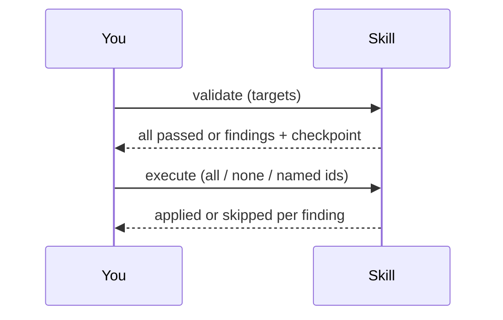

# Orchestration Quality Control

This package checks the quality of the documents that define and coordinate
an agentic process — not the code an agent writes, but the workflow files,
orchestrator documents, and rules files that tell an agent system how to
delegate work, validate results, ask for approval, keep state, and stop
safely.

Given one or more target files, it classifies each one, checks it against a
packaged set of rules, and produces two things: a list of specific findings
(what is wrong, where, and a proposed fix) and a short plain-language report
a non-technical reader can follow. The root session interviews once — collecting
outcome, targets, profile, language, and the apply decision — then hands the run
to the engine; nested agents never ask the user anything. The only mid-run human
contacts are a `blocked` envelope and the circuit breaker's `awaiting_authorization`,
both engine states the root session surfaces.

## Why this exists

This package started as part of a larger, product-specific quality-control
system that mixed two concerns that do not belong together:

1. **Generic orchestration checks** — delegation completeness, bounded retries, durable state, approval ownership — useful for any agent workflow.
2. **Domain-specific checks** — artifact shape for one product's test suite — useful only to that project.

Coupling them made the tool look like a niche linter while actually trying to be a portable orchestration gate. Worse, early versions relied heavily on model consistency for mechanical steps (classification, finding identity, checkpoint transitions), which produced **different findings for identical input** and sometimes reported edits as applied when they were not safe.

This package keeps the generic checks as the reusable core. Domain checks
live in optional profiles (see `profiles/example-pipeline/` for a fictional
worked example). Running the core with no profile selected performs only
the generic checks.

## How it is used

Two operations, always in this order:

1. **`validate`** — point the skill at one or more target files. It reports
   back either "nothing wrong" or a list of findings plus a durable record
   of the run (called a checkpoint) that a person can review and act on
   later, even after the conversation ends.
2. **`execute`** — given that checkpoint and a decision (apply every
   finding, apply none of them, or apply a specific named subset), the skill
   applies exactly the approved fixes and reports what changed. Anything it
   could not safely apply is reported as skipped, with a reason — never
   silently dropped and never falsely claimed as done.

3. **`upgrade_prepare` / `upgrade_apply`** — discover an existing
   orchestration mechanism, compare it with a selected OQC reference template,
   draft a complete replacement plus `ARCHITECTURE.md`, checkpoint the literal
   preview, and apply only an atomic approve/decline decision. Host entry
   points: Claude `/oqc-upgrade`, Cursor `/oqc-upgrade`, Codex
   `orchestration-upgrade`, AGY `/orchestration-upgrade`.

**`author_prepare` / `author_apply`** — audit the workspace, interview only
what the audit cannot answer, draft process documents, QC them internally,
apply into an empty directory after approval. See
[`docs/authoring.md`](../docs/authoring.md). Host entry points: Claude
`/oqc-author`, Cursor `/oqc-author`, Codex `orchestration-author`, AGY
`/orchestration-author`.

**`orchestration-engine`** — deliver a runnable client engine. The workflow
starts with an interview of the client repository owner. Its recorded decisions
are kept in the client's `orchestration/client-spec.json`, and the compiler
creates an interview-backed `orchestration/IMPLEMENTATION_PLAN.md` before
emitting and checking the engine. The package carries no client-specific
profiles or requirements.

## What makes the checks trustworthy

A quality-control tool is only useful if running it twice on the same input
gives the same answer, and if a fix it claims to have applied was actually
applied. Two design choices in this package exist specifically to guarantee
that:

- **The mechanical parts are ordinary code, not a language model.** Deciding
  what kind of document a file is, computing a stable identifier for each
  finding, tracking whether a review is still pending or has been resolved,
  and turning a proposed fix into an actual diff are all handled by small
  Python scripts under `scripts/`, not by asking a model to be consistent.
  Those scripts have their own automated tests that run with no model
  involved at all. A model is only ever asked to do the two things a script
  cannot: judge whether a specific passage violates a specific rule, and
  write the plain-language explanation.
- **A proposed fix must quote the file it is fixing.** Every finding has to
  include the exact text it is pointing at. If that text cannot be found in
  the file — because the finding was invented, or because someone already
  fixed it — the finding is rejected automatically, before a person ever
  sees it. This also means a target file cannot trick the system into
  approving an unwanted edit by phrasing something persuasively: proposed
  changes are always shown to the person approving them as an actual before
  and after comparison of the real file, never as a description someone has
  to take on faith.

## What is in this package

- `SKILL.md` — the entry point a host agent reads to learn how to use this
  skill.
- `scripts/` — the small, dependency-free Python programs described above,
  along with their tests.
- `references/rules/` and `references/workflows/` — the packaged policy and
  procedures the checks are built from.
- `references/schemas/` — the exact shape every finding, checkpoint, and
  input must take.
- `references/templates/` and `references/plain-language/` — shared
  document skeletons and report-writing guidance, including support for
  Brazilian Portuguese reports.
- `profiles/` — optional add-ons, such as the fictional `example-pipeline`
  profile, that extend the core with domain-specific checks.
- `adapters/claude/` — how this skill runs inside Claude Code specifically:
  the checking, editing, and coordinating roles are isolated into three
  separate, narrowly-permissioned agents (Orchestrator, Validator,
  Remediator). A reproducible `build_plugin.py` produces
  `dist/claude-marketplace/` for `/plugin marketplace add` install; the
  README documents marketplace as preferred, manual copy as fallback, and
  OpenSkills/skill-only install as unsupported (returns `blocked`).
- `adapters/codex/` — a reproducible Codex plugin build, three nested custom
  agent profiles, an approval-enforcement hook, and the explicit bootstrap
  required because Codex discovers custom agents outside plugin manifests. Its
  README documents the only supported Codex installation path via the single
  `install_codex.py` front door; installing the portable skill alone is
  intentionally not sufficient for Codex.
- `adapters/cursor/` — a native Cursor plugin build with the same three-role
  topology, bundled subagents, an approval-enforcement hook, and a local
  installer for `~/.cursor/plugins/local/`.
- `adapters/agy/` — a native Antigravity (AGY) plugin build with the same three-role
  topology, bundled subagents, lifecycle hook guard (`PreToolUse`), rules, and
  a local installer for `~/.gemini/antigravity-cli/plugins/` or `.agents/plugins/`.

## Where runtime data lives

A checkpoint created while running this skill is never stored inside this
package. It lives in the workspace being checked, under
`.orchestration-qc/state/`, and is deleted or superseded once a review is
resolved. This keeps the package itself a fixed, shareable set of rules and
code, separate from the record of any particular run.
