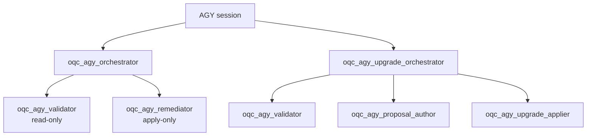

# Antigravity (AGY) adapter

This adapter packages the portable `orchestration-quality-control` skill as a
native Antigravity (AGY) plugin. It mechanizes the portable core rules into
an isolated nested subagent topology with a lifecycle hook guard.



```text
AGY session
├── oqc_agy_orchestrator
│   ├── oqc_agy_validator
│   └── oqc_agy_remediator
└── oqc_agy_upgrade_orchestrator
    ├── oqc_agy_validator
    ├── oqc_agy_proposal_author
    └── oqc_agy_upgrade_applier
```

## What this adapter adds beyond the portable core

| Piece | What it does |
| --- | --- |
| `plugin.json` | Plugin manifest declaring the plugin name, version, and metadata for AGY. |
| `skill-overlay.md` | Injected instructions for the AGY root session, subagent coordination, and interview flow. |
| `agents/oqc_agy_orchestrator.md` | Orchestrator agent: coordinates validation and remediation without reading or modifying target content directly. |
| `agents/oqc_agy_validator.md` | Validator agent: strictly read-only inspection of target files against OQC rules. |
| `agents/oqc_agy_remediator.md` | Remediator agent: applies only authorized before/after changes via `replace_file_content`. |
| `agents/oqc_agy_upgrade_orchestrator.md` | Upgrade/Author orchestrator: coordinates guided upgrades and greenfield authoring. |
| `agents/oqc_agy_proposal_author.md` | Proposal author agent: drafts atomic upgrade or authoring proposals. |
| `agents/oqc_agy_upgrade_applier.md` | Upgrade applier agent: applies approved proposals into destination workspaces. |
| `rules/AGENTS.md` | Workspace rules enforcing topology isolation, state protection, and edit gating. |
| `hooks/hooks.json` | AGY lifecycle hook configuration registering the `PreToolUse` safety gate. |
| `hooks/oqc_agy_guard.py` | `PreToolUse` hook script that blocks unauthorized edits and writes to protected targets while a QC review is pending. |
| `hooks/agy_authorization.py` | Utility to create and clear cryptographic authorization records for approved findings. |

## Installation

### Local installation (recommended)

From the repository root, run the installer:

```bash
# Install for user (global in ~/.gemini/antigravity-cli/plugins/):
python3 orchestration-quality-control/adapters/agy/install_agy.py

# Or install for current project workspace (.agents/plugins/):
python3 orchestration-quality-control/adapters/agy/install_agy.py --scope workspace
```

Use `--dry-run` to preview the installation, and `--uninstall` to safely remove an
unchanged managed plugin.

### Building distribution archive

Build the reproducible marketplace distribution:

```bash
python3 orchestration-quality-control/adapters/agy/build_plugin.py
```

The output in `dist/agy-marketplace/` contains the complete ready-to-load plugin
tree, `plugins.json` registry, `BUILD-MANIFEST.json`, and a standalone `install_agy.py`.

## Lifecycle hook guard

Antigravity executes `hooks/oqc_agy_guard.py` on the `PreToolUse` event for tools
`replace_file_content`, `write_to_file`, and `run_command`.

When an active checkpoint has `status: pending_approval`:

1. Direct file overwrites (`write_to_file`) targeting files under review are denied.
2. Content replacements (`replace_file_content`) are checked against the authorization record (`.orchestration-qc/state/agy-authorization-<run_id>.json`). Only changes matching the exact SHA-256 hash of the approved before/after text are allowed.
3. Arbitrary shell commands are blocked, allowing only the deterministic script allowlist.
