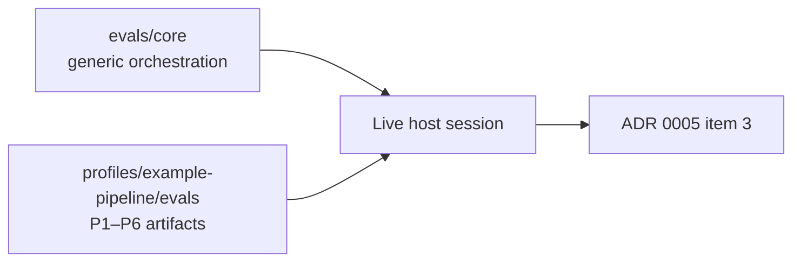

# Evaluations

Two eval sets, in the same shape (`skill_name`, `profile`, an `evals` array
of `{id, prompt, expected_output, files, assertions}`):

- `core/evals.json` — generic orchestration checks only, against fixtures
  in `core/fixtures/`. This is the fixture set
  `AI_Codex/Architecture/ADR/0005-definition-of-done.md` requires to exist for item 2 of the
  extraction's definition of done.
- `../profiles/example-pipeline/evals/evals.json` — four scenarios for the
  fictional pipeline-artifact profile (inline env or secrets, missing gates,
  a disconnected job, and a generator source with rationale clauses).

## How these are run

Neither eval set includes its own grading harness. Running one means
opening a real host session, invoking the skill with each eval's `prompt`
against its `files`, and checking the resulting report and behavior against
that eval's `assertions`.

This step requires a live model and was not run as part of building this
package — see `AI_Codex/Architecture/ADR/0005-definition-of-done.md` for what is verified
today (the deterministic scripts, a full simulated validate/execute cycle,
and fixture classification) versus what is still open (the eval prompts
actually graded against a live run).
